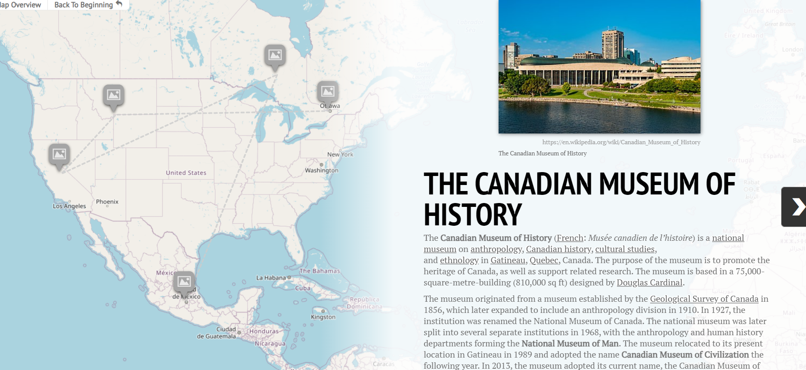
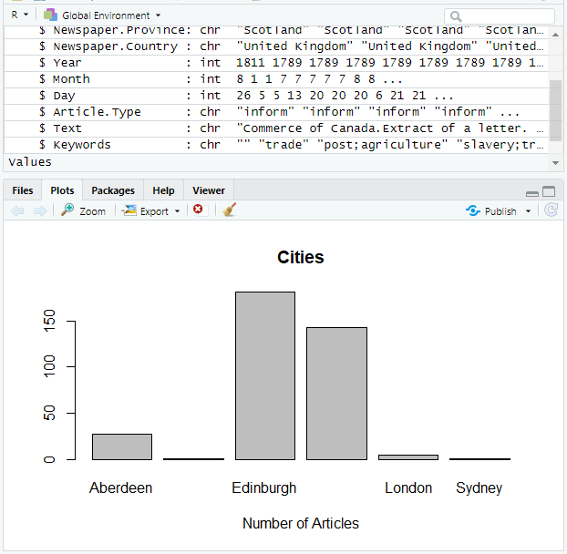
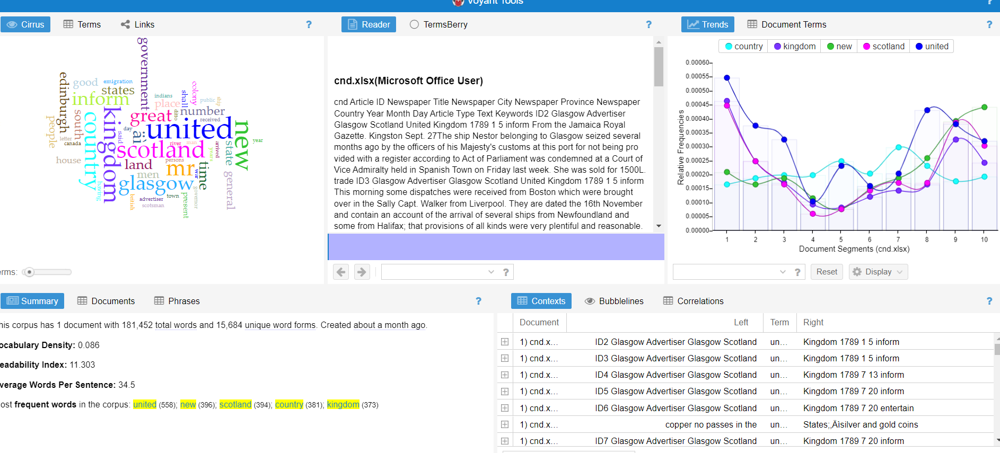

## instructions

The 'log' is a scratch pad where you jot down observations, problems, solutions, links that help you, anything really, as you work through the relevant tutorials. **It is ok if you get stuck** when doing the tutorials; your log is what enables me to help you overcome the challenges. Your log gives me a glimpse into your workflow and practice. Hit the pencil icon to edit this document.

It can be helpful to drag-and-drop screenshots of your work when you hit an error. On a mac, hit cmd + 4 to highlight the area of the screen you want to screenshot; on a Windows machine, you can hit the windows key + g to do the same thing. Drag and drop the screenshot into this folder. You can embed the image into this text file by following this pattern:

``

Once you hit the 'commit' button, Github will embed the image. **nb** nothing saves unless you hit the commit button.

## Log for Part Three

Date: 5th of june 2022

Name: Alake Mills

Sequence That You Are Following:

#### Name of Tutorial:
Newcomer Sequence

make your observations here

**Things that challenged me:**
I got stuck while adding words to my voyant corpus stoplist, i could not go further. 

**Where I went for help:**

[How to use rcurl on windows](https://voyant-tools.org/docs/#!/guide/tutorial)

** I followed the instruction in the voyant documentation, and i was able to add words to the stoplist **

#### Name of Tutorial

make your observations here

**Things that challenged me:**

**Where I went for help:**
