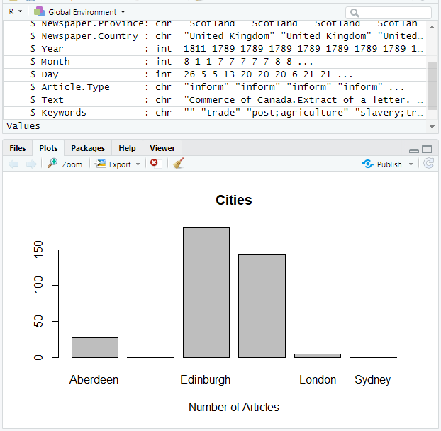
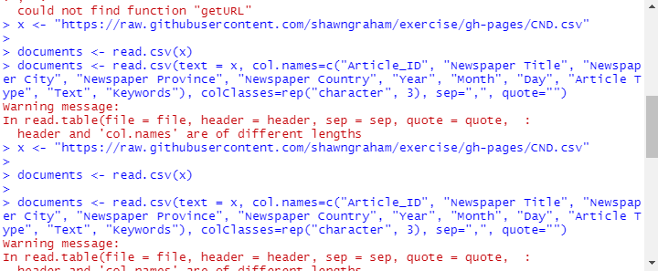
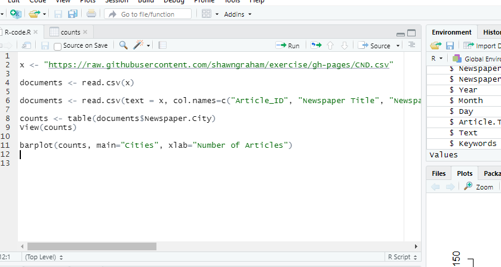

## instructions

The 'log' is a scratch pad where you jot down observations, problems, solutions, links that help you, anything really, as you work through the relevant tutorials. **It is ok if you get stuck** when doing the tutorials; your log is what enables me to help you overcome the challenges. Your log gives me a glimpse into your workflow and practice. Hit the pencil icon to edit this document.

It can be helpful to drag-and-drop screenshots of your work when you hit an error. On a mac, hit cmd + 4 to highlight the area of the screen you want to screenshot; on a Windows machine, you can hit the windows key + g to do the same thing. Drag and drop the screenshot into this folder. You can embed the image into this text file by following this pattern:

``

Once you hit the 'commit' button, Github will embed the image. **nb** nothing saves unless you hit the commit button.

## Log for Part Two

Date: 28/05/2022

Name: Alake Mills

Sequence That You Are Following:

#### Name of Tutorial : Some Basic Counting and Plotting in R

make your observations here

**Things that challenged me:**

> library("RCurl")
Error in library("RCurl") : there is no package called ‘RCurl’

** I was getting mutiple errors while running the R code **

Error in getURL("https://raw.githubusercontent.com/shawngraham/exercise/gh-pages/CND.csv",  : 
  could not find function "getURL"

**Where I went for help:**

 [How to use rcurl on windows](https://stackoverflow.com/questions/39627639/unable-to-use-rcurl-in-r-on-windows)

   ** I followed the instruction in the tutorials to resolve the getURL issue **

